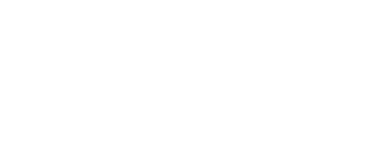

# Welcome to the Python Essentials Class

Wintellect helps you drive innovation by modernizing your applications and data. We offer Cloud Managed Services to save you money, maximize up-time, and enable you to focus on business strategy rather than managing IT infrastructure. And we skill up your team to enable them to quickly apply the latest technologies in software, cloud, DevOps and data. Wintellect is the partner that enables you to achieve more. A company of experts and a creator of experts. Wintellect: We Know How.

# Python Essentials Course Syllabus

1. Overview of Python
1. Flow Control
1. Sequence Types
1. Sorting and Slicing
1. Functions
1. Dictionaries and Sets
1. Object-oriented Python
1. Creating and Using Modules
1. Errors and Exception Handling
1. Working with Files
1. Regular Expressions
1. Using the Standard Library